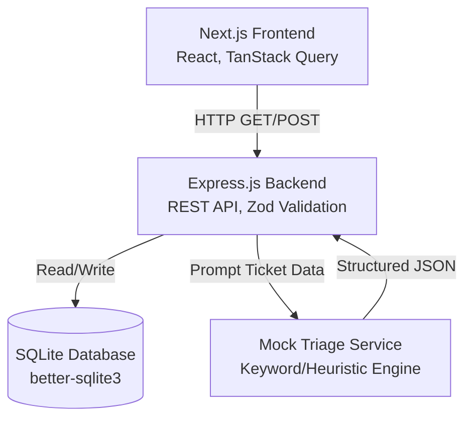
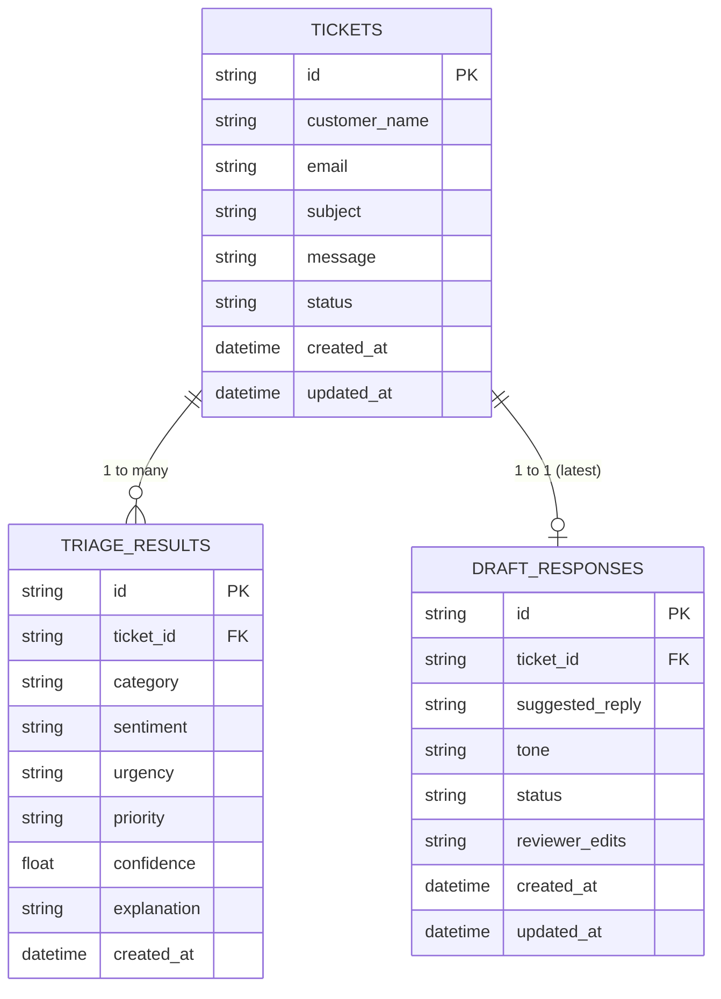
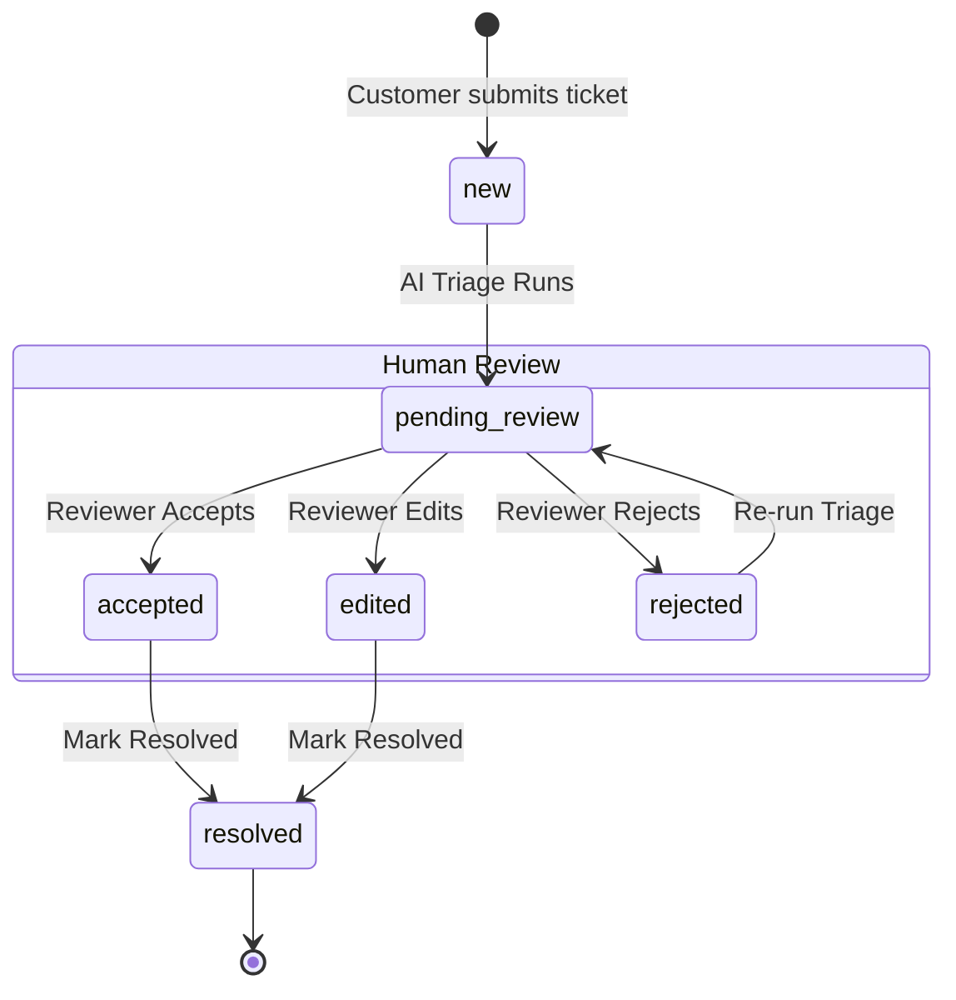

# System Design & Explanation: Support Inbox AI Triage

This document provides a comprehensive explanation of the architectural decisions, data models, and workflows implemented for the Support Inbox AI Triage assignment.

---

## 1. Architectural Overview

The application is built as a **Monorepo** using npm workspaces, separating the frontend and backend into independent packages. This mirrors production environments where the frontend and API scale and deploy independently.

### Why this stack?
- **Backend (Express.js + TypeScript)**: Express is the standard for Node.js REST APIs. By keeping it separate from the Next.js frontend, we ensure the backend can be independently tested (via Supertest/Vitest) and graded.
- **Frontend (Next.js 14 App Router)**: Provides a robust React framework with file-based routing. We use TanStack Query for server state management (caching, polling, optimistic updates).
- **Database (SQLite)**: Chosen for simplicity and zero-configuration setup, meeting the assignment's requirement for a lightweight storage solution. `better-sqlite3` provides a fast, synchronous API.
- **Validation (Zod)**: Used extensively on the backend to validate incoming API payloads and, crucially, to validate the output from the AI Triage service before it hits the database.

---

## 2. Data Model & State Machine

The core entities are **Tickets**, **Triage Results**, and **Draft Responses**.

### Entity Relationship

### Ticket Status Workflow (State Machine)
Tickets follow a strict workflow ensuring human oversight before resolution.

---

## 3. AI Triage Service Strategy

The AI Triage requirement is fulfilled using a **Mock LLM Strategy** that simulates an LLM returning structured JSON. 

### Why a Mock?
The assignment permits a documented mock mode. This avoids the need for reviewers to supply their own API keys (OpenAI/Gemini) while still demonstrating how an LLM integration would be architected.

### How it works:
1. **Input**: Ticket subject and message.
2. **Heuristics**: The service uses keyword matching (e.g., "crash", "error" → `bug`, `critical`; "charge", "refund" → `billing`).
3. **Structured Output Generation**: It generates a structured payload matching the required output schema.
4. **Zod Validation Barrier**: Before the backend accepts the AI's output, it is passed through a strict Zod schema (`RawLLMOutputSchema`). 
5. **Confidence & Fallbacks**: If the AI (mock or real) returns low confidence (<0.6), the explanation flags it for manual review. If validation fails entirely (simulating an LLM hallucination), a safe fallback response is returned.

To switch to a real LLM in the future, the `TriageService` class is designed to read the `LLM_PROVIDER` environment variable and route to the appropriate implementation.

---

## 4. Bonus Extension: SLA Warning

We implemented **Extension B: SLA Warning**.

### Logic
- **Configuration**: An environment variable `SLA_URGENT_HOURS` defines the threshold (default: 4 hours).
- **Trigger**: A ticket breaches the SLA if:
  1. Its urgency is `high` or `critical`.
  2. Its status is NOT `resolved` or `rejected`.
  3. Its age (`Date.now() - created_at`) exceeds the threshold.
- **UI Integration**: 
  - The Inbox list shows a pulsing red `⚠ SLA` badge on breached tickets.
  - The Analytics dashboard calculates the total `sla_risk_count` and highlights the metric in red.

---

## 5. Security & Edge Cases Handled

- **Data Integrity**: Zod schemas prevent malformed data from entering the database via POST requests.
- **State Machine Guards**: The `/api/tickets/:id/review` endpoint enforces state. You cannot "review" a ticket that is in the `new` or `resolved` state. You can only resolve a ticket that has been `accepted` or `edited`.
- **CORS**: The Next.js frontend proxies API requests (`/api/*` → `http://localhost:3001/api/*`), avoiding browser preflight/CORS issues and keeping the architecture clean.
- **Loading/Error States**: The frontend uses TanStack Query to gracefully handle loading skeletons and API errors, ensuring a smooth user experience even if the backend is slow or offline.
